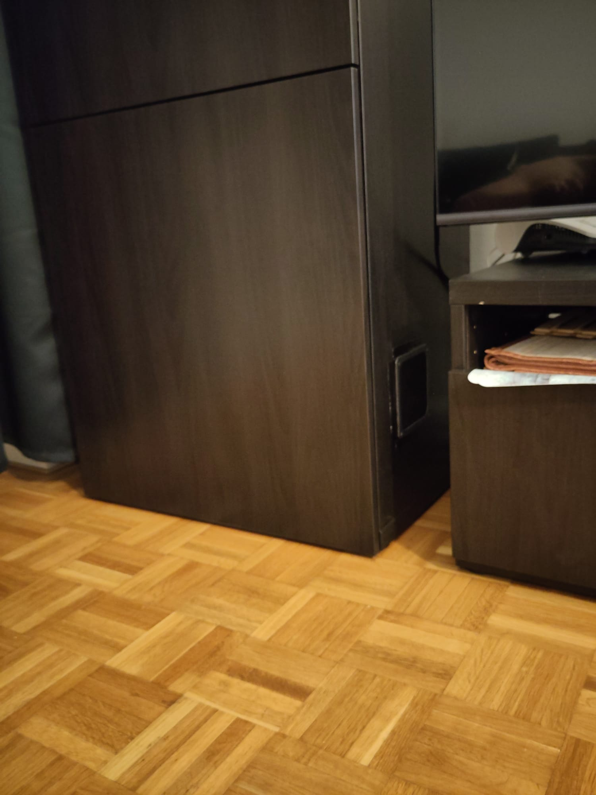
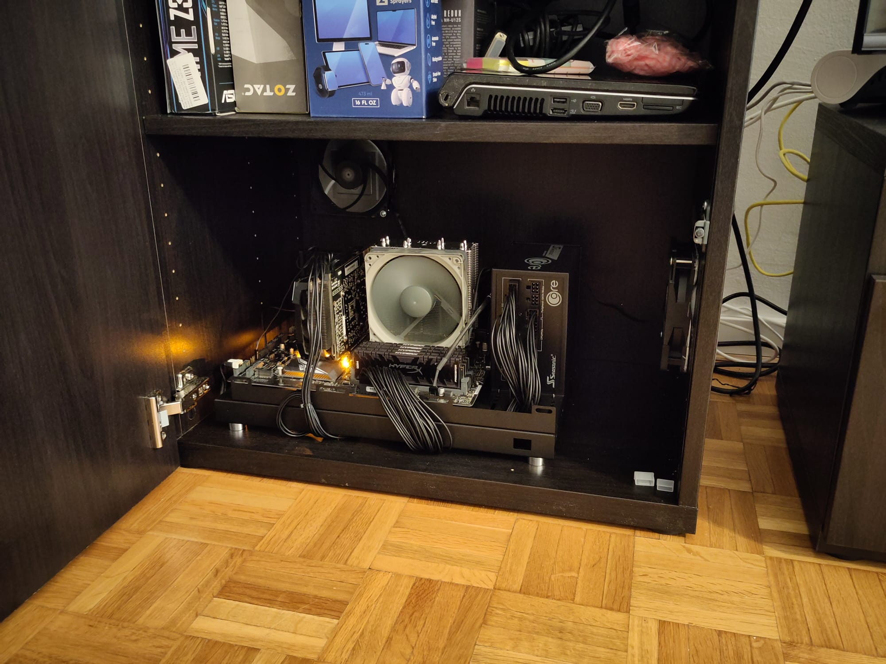
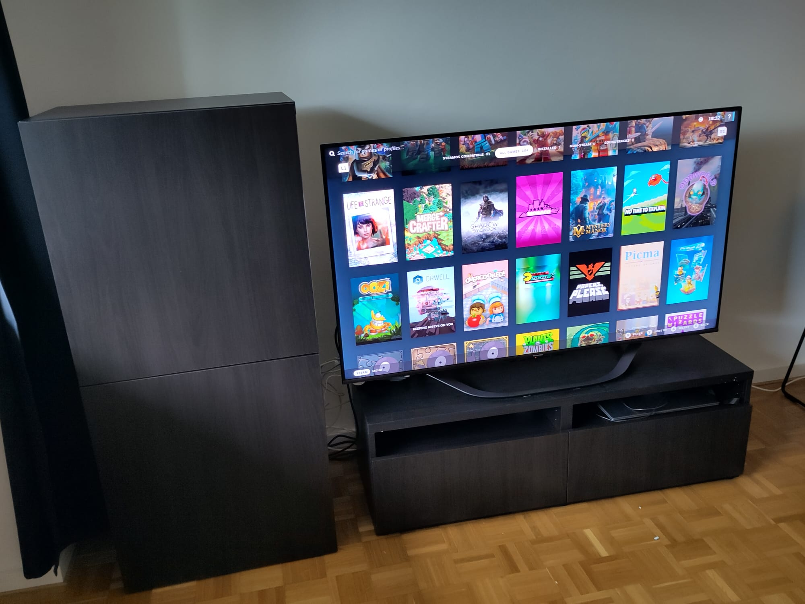

# Benizzio's ultimate guide for the god-level (not handheld) Linux gaming machine - 2026 edition

After a few years of experience and skin in the game on the subject, I finally feel comfortable publishing this guide for anyone who asks for help and recommendations.

<table>
    <tr>
        <td></td>
        <td></td>
        <td></td>
    </tr>
</table>

Those are pictures of the "Steam Machine" I built with the old parts of my retired [PC1 & PC2](hardware/personal/setups/past.md) builds: an Intel processor with a very old NVIDIA graphics card. Any hardware is viable in the current scenario, thanks to the efforts of Valve and the FOSS community.

Below, you'll find what you need to start from scratch.

## Step 1 - The baseline

Use [CachyOS](https://cachyos.org/) [Desktop Edition](https://wiki.cachyos.org/installation/installation_on_root) with KDE Plasma (thank me later), the Arch-based wonder that has taken the spot of Linux gaming due to its incredibly active community and the awesome optimizations they provide. With it, you don't even need to worry about drivers for NVIDIA graphics cards. It's all built in. 

In the welcome screen, make sure to use the welcome GUI to install the [Essential Gaming Packages](https://wiki.cachyos.org/configuration/gaming/#essential-packages)
Make sure to use their version of Proton, Wine and etc.

Their [complete gaming guide](https://wiki.cachyos.org/configuration/gaming) is awesome!

Next, install [LinuxToys](https://github.com/psygreg/linuxtoys). This already has a bunch of useful stuff to set you up with some button clicks, but pay extra attention to the `Extras` section. Install `Shader Booster` as a mandatory step. Check the rest to see if it interests you.

## Step 2 - The Desktop

If you are assembling a couch-based gaming "Steam Machine", ignore this and jump to the next step.

If you are assembling a gaming PC to be used at a desk, also for non-gaming purposes, the base Cachy setup is done. The rest is down to your own customization. Feel free to browse my [Software Reference](software/README.md) to find cool stuff. Cachy already comes with [GOverlay](https://github.com/benjamimgois/goverlay). This tool is your friend, explore and learn how to use it.

For non-steam games (or even as a place to centralize Steam with other game sources) use [Lutris](https://lutris.net) and thank me later.

## Step 3 - OPTIONAL - The "Steam Machine"

For the ultimate couch PC gaming experience, install [arch-deckify](https://github.com/unlbslk/arch-deckify). After installation, your PC has a gaming mode similar to the Steam Deck and the Steam Machine, which overrides the normal desktop environment and controls the computing resources and configs automatically. You can freely switch between both.

If you have older or weaker hardware and a 4K TV, in "Gaming Mode" be sure to go to `Settings` -> `Display` and disable `Automatically Set Resolution`, then set `Resolution` and `Maximum Game Resolution` to something your hardware can handle. Steam's `gamemode` will automatically upscale the content to your TV resolution.
