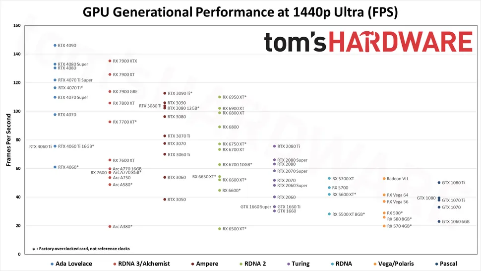

# Hardware guide

Personal setups and buying guide for hardware and related items.

## Index

1. [Supplies](supplies.md)
1. [Wishlist](personal/wishlist.md)
1. [Setups](personal/setups)

## Buying guides

### Pricing

 - [PCPARTPICKER price trends](https://de.pcpartpicker.com/trends/price/cpu/?currency=eur)

### Testing and benchmark data

- [LTTLabs](https://www.lttlabs.com) - Linus Tech Tips database for benchmarks and testing of hardware

