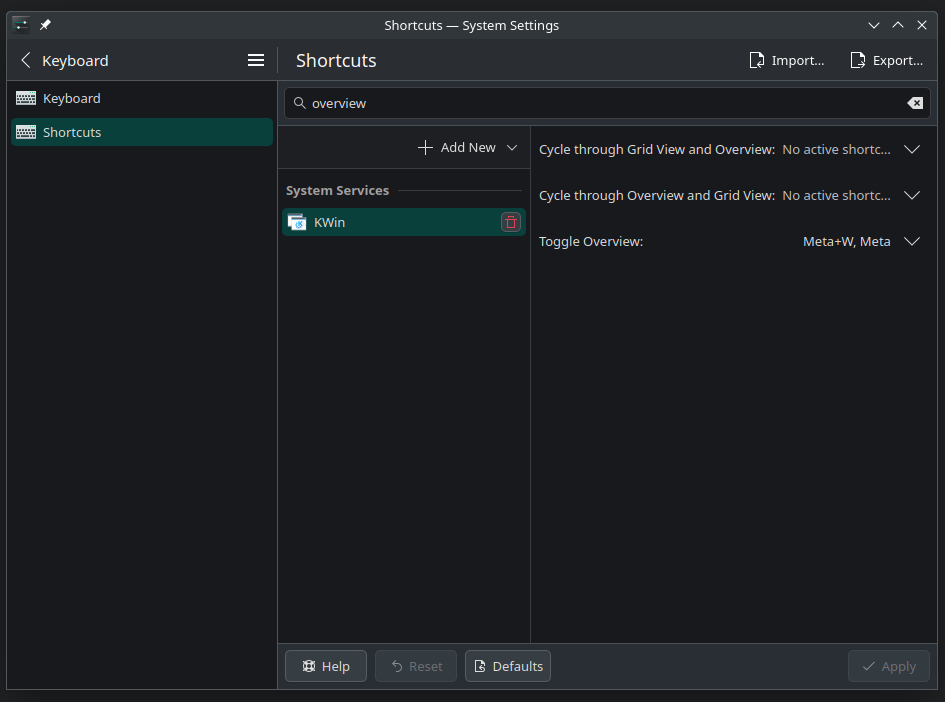

# Personal configuration helper

Quick references for my personal preferred configurations

## Manjaro

### KDE Plasma

- set meta (windows) key as overview shortcut
    - OLD config:
        ```zsh
        # INSIDE ~/.config/kwinrc #########
        #
        # [ModifierOnlyShortcuts]
        # Meta=org.kde.kglobalaccel,/component/kwin,,invokeShortcut,Overview
        #
        ###################################

        # logoff!
        ```
    - NEW config:
        - `System settings` >> `Shortcuts` >> `Global Shortcuts` >> `KWin` >> `Toggle Overview`
        - 

